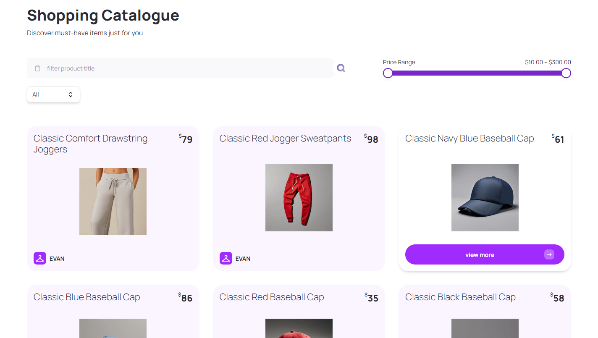

# FashionFlex

_Style, Quality, Convenience—All in One Place_
  

 

## Overview and Features

FashionFlex, your destination for the latest trends in clothes, electronics, furniture, shoes, and more, all in one place.
  

## Tech Stack

### Front-End

#### Next.js
- Server-Side Rendering (SSR) and Static Site Generation (SSG): Renders pages on the server for faster initial load times and pre-renders pages at build time, enhancing SEO and providing fast load times with improved performance. In FashionFlex, SSR and SSG are used to render product pages, category listings, and populate data efficiently, ensuring a smooth user experience.
  
- Real-Time Search Filtering: Leverages Next.js server components to pre-fetch and render data, ensuring immediate response to user queries. In FashionFlex, the useRouter hook is used to update search parameters, allowing users to filter products by name, description, category, and price range with immediate updates, providing an interactive and dynamic shopping experience.

#### TypeScript
- Adds static type checking and interfaces.
- Improves code quality and maintainability by catching errors early.

#### Styled with Tailwind CSS and Headless UI
- Headless UI provides components such as dropdown menu for product category that integrate beautifully with Tailwind CSS.

### Public API
- Leverages Platzi Fake Store API to fetches products, categories, and price information.
- Allows users to browse and search products by keyword and description.
- Also provide filters such as category and price range to refine search results.
  

## Features

### Search Products Feature

In shopping catalogue, products are organized in cards. In each card contains a product's name, category, price and image. User can click view more to see product description.
  

https://github.com/user-attachments/assets/c8ed44e5-6997-4421-8fef-3917d335f7b8

The search feature allows you to search for all kind of products by using keywords that match the product's description.
  

---

### Filter product Feature

https://github.com/user-attachments/assets/b35e53bd-0327-4e70-8286-bfcde3e3705e

The filter feature allows you to filter products based on its category. You can also filter products based on its price range by adjusting the slider. The filter is updated instantly without having to reload the page.
