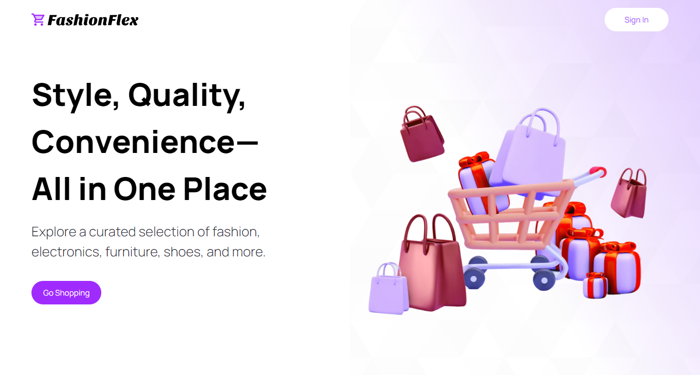
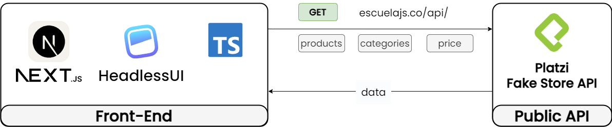

# FashionFlex
_Style, Quality, Convenience—All in One Place_
  

## Overview and Features
FashionFlex, your destination for the latest trends in clothes, electronics, furniture, shoes, and more, all in one place.

## Tech Stack

### Front-End
RentFinder's front-end is built with Next.js, enabling fast, SEO-friendly applications through server-side rendering and static site generation. Tailwind CSS is used for rapid UI development with a clean, maintainable codebase, ensuring a seamless user experience for navigating listings and searching properties.

### Back-End
The back-end of RentFinder leverages Next.js as a full-stack solution, utilizing the App Router for intuitive and scalable page routing and Route Handlers for managing API endpoints efficiently. NextAuth.js is integrated for seamless Google authentication, and middleware functions ensure secure and optimized request processing, enhancing the overall robustness and security of the application.

## Features

### Search Products Feature

https://github.com/user-attachments/assets/c8ed44e5-6997-4421-8fef-3917d335f7b8

The search feature allows you to search for all kind of products by using keywords that match the product's description.

### Filter product Feature
https://github.com/user-attachments/assets/b35e53bd-0327-4e70-8286-bfcde3e3705e

The filter feature allows you to filter products based on its category. You can also filter products based on its price range by adjusting the slider. The filter is updated instantly without having to reload the page.

